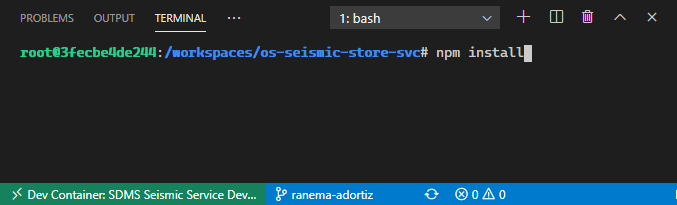

## Background
The goal of this .devcontainer is to create a VS Code container with all the tools, libraries, and frameworks so that developers on the SDMS project team can quickly begin developing without having spending cycles setting up the correct development environtment. 

This README assumes you have followed the installation steps outlined [here](https://code.visualstudio.com/docs/remote/containers#_installation). 

## Visual Studio Code Remote - Containers
Using the [Visual Studio Code Remote - Containers](https://code.visualstudio.com/docs/remote/containers) feature allows for creation of a Docker container that is configured with the correct development environment. . We will use folder-based devcontainers for this repo. 


### Folder-based Devcontainers
This current Devcontainer is built for folders.  Currently the Docker image installs the following tools and libraries. See Dockerfile for more details.
#### Tools and Libraries
* Node 12.16.3
* Go 1.12.17
* Terraform 1.12.24
* Kubectl
* Helm
* Azure CLI
* Docker CE CLI

#### Extensions
The image also has the following VS Code extension installed. See devcontainer.json for more details.
* mauve.terraform
* ms-azuretools.vscode-azureterraform
* ms-vscode.azurecli
* ms-azuretools.vscode-docker
* ms-kubernetes-tools.vscode-kubernetes-tools


## Gettting started 
Clone this repo, you will notice that there is a .devcontainer directory. Inside this directory is the Dockerfile and devcontainer.json which tell VS Code how to build the container. 

Start VS Code, and in a new window, click on the quick actions stations on the lower left corner. Select  'Remote-Containers: Open Folder' in Container from the command list that appears. As you see on the screenshot below. 


Select the repo that you just clone (the one with .devcontainer directory at the root), this will cause VS Code to build the container and open the directory as you can see below. 


You can start a new terminal window and build the project as outlined [here](../README.md). 

> Note: This devcontainer does not auto-install the `node_modules` directory. That directory holds the package dependencies needed for the project. Package dependencies are listed in `package.json` and created when running `npm install`.



## Troubleshooting Devcontainers

If you're having trouble, the below documented errors may save you some time and get you back on track.

- **General Error**: There's a broad range of install errors that can be resolved by deleting both the `node_modules` and `dist` directory and then rebuilding the container. Having a strong hardwired network connection can speed up the `npm install` process and reduce the risk of installation timeouts.

    ```bash
    $ tree os-seismic-store-svc
    ├───.devcontainer
    ├───.vscode
    ├───...
    ├───node_modules # generated from running npm install
    └───...
    ```
