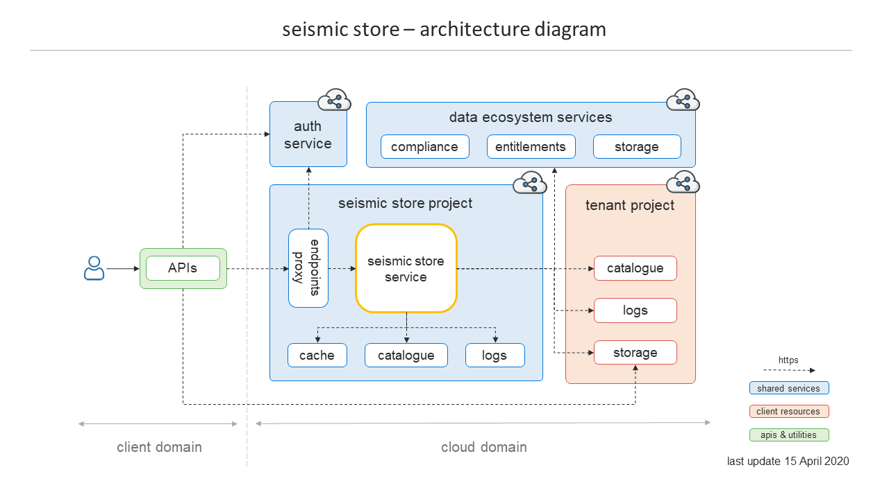

# SEISMIC STORE

Seismic Store is a cloud-based solution designed to store and manage datasets of any size in the cloud by enabling a secure way to access them through a scoped authorization mechanism. Seismic Store overcomes the object size limitations imposed by a cloud provider, by managing generic datasets as multi independent objects and, therefore, provides a generic, reliable and a better performed solution to handle data on a cloud storage.

Saving a dataset on a cloud-based storage, as single entity, may be a problem when it exceeds the maximum allowed object size. Adopting a single object storage approach is also not an optimal solution in terms of performance as a single entity cannot be easily uploaded and downloaded directly in parallel.

Seismic Store is a cloud-based solution composed by restful micro-services, client APIs and tools designed to implement a multi-object storage approach. The system saves objects that compose a dataset as a hierarchical data structure in a cloud storage and the dataset properties as a metadata entry in a no-relational catalogue. Having the datasets stored as multiple independent objects improve the overall performance, as generic I/O operations, for example read or write objects, can be easily parallelized.

Seismic Store manages data authorization at service level by protecting access to storage bucket resources. Only service authorized users are enabled to directly access a storage resource. The service implements a mechanism that generates an “impersonation token” by authorizing long running/background production jobs to access data without requiring further user interactions.



```python
# build the service
npm run build

# start the service
npm run start

# run integral/unit tests
npm run test

# run integral/unit tests and generate the code coverage
npm run code-coverage

# run the regression/e2e test suite
./tests/e2e/run_e2e_tests.sh \
    --seistore-svc-url="seismic store service url" \
    --seistore-svc-api-key="seismic store service api key" \
    --user-idtoken="user or service agent idtoken" \
    --tenant="seistore working tenant" \
    --subproject="seistore working subproject" \
    --admin-email="admin email"

# run the parallel regression/e2e test suite (add the --run-parallel option)
./tests/e2e/run_e2e_tests.sh \
    --seistore-svc-url="seismic store service url" \
    --seistore-svc-api-key="seismic store service api key" \
    --user-idtoken="user or service agent idtoken" \
    --tenant="seistore working tenant" \
    --subproject="seistore working subproject" \
    --admin-email="admin email" \
    --run-parallel

# run the linter on sources
tslint -c tslint.json -p tsconfig.json 'src/**/*.ts'
```

## Environment configuration

Environment variables can be provided with a `.env` file in the root of the project to be consumed
by [dotenv](https://github.com/motdotla/dotenv). Environment variables are [preloaded](https://github.com/motdotla/dotenv#preload)
by the `npm start` command with the argument `-r dotenv/config`. A template `.env` file can be found
in `/docs/templates/.env-sample`.
